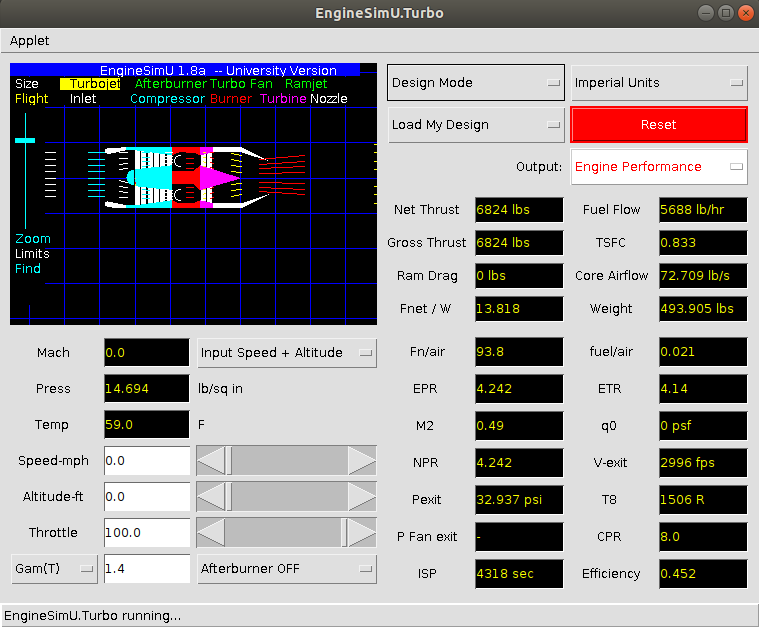

# NASA Glenn Research Center - Interactive Computer Programs for Students

Với mục đích hỗ trợ giảng dạy khoa học và toán học, NASA Glenn Research Center đã phát triển một loạt các chương trình máy tính tương tác dành cho sinh viên và miễn phí chia sẻ chúng trên trang [NASA Free Software](https://www.grc.nasa.gov/www/k-12/freesoftware_page.htm). Đồng thời, họ cũng đã phát triển các hướng dẫn **Beginner's Guides** cho mỗi gói phần mềm nhằm giải thích các kiến thức khoa học, toán học liên quan và chia sẻ chúng ở cuối trang web trên. Dành cho giáo viên thì có tới 200 **hoạt động và bài học** để dạy và kiểm tra kiến thức sinh viên được chia sẻ ở địa chỉ [Aerospace Activities and Lessons](https://www.grc.nasa.gov/www/k-12/aeroact.htm). Đây thực sự là một nguồn kiến thức vô cùng phong phú và bổ ích cho tất cả sinh viên, giáo viên, kỹ sư, nhà nghiên cứu hàng không, vũ trụ.

Các phần mềm tính toán, mô phỏng này có thể được chia làm 5 loại cơ bản liên quan tới **động cơ phản lực, tên lửa, airfoil, ống khí động thực nghiệm - (hầm gió - wind tunnel), chất khí**. Chúng được viết bằng ngôn ngữ Java với ý định ban đầu là các ứng dụng nhỏ (applet) chạy trực tiếp trên các trình duyệt web. Tuy nhiên việc này không phải lúc nào cũng khả thi. Do đó Jef Poskanzer đã viết bổ sung một MainFrame để hỗ trợ chạy applet như một chương trình độc lập từ những năm 1996.

# Hướng dẫn cài đặt, sử dụng

1. Download chương trình 
Để tải toàn bộ các chương trình này, click vào **Clone** trên [https://github.com/SangVn/NASA_Free_Software](https://github.com/SangVn/NASA_Free_Software), chọn **download ZIP**, sau đó giải nén.

2. Cài Java cho hệ điều hành
Để chạy các chương này, cần phải cài đặt Java cho Linux hoặc Windows. Trong Linux, tại thời điểm hiện tại, có thể cài đặt Java Open JDK version 11 bằng câu lệnh:
`$ sudo apt install openjdk-11-jdk`.
Đối với Windows, hãy làm theo hướng dẫn tải và cài đặt trên trang chủ [java.com](https://www.java.com/en/download/help/windows_manual_download.xml).

3. Chạy chương trình
Để chạy một chương trình bất kì, trong thư mục được tải về, đối với Linux - click chuột phải, chọn **Open in Terminal**; đối với windows - giữ phím Shift, click chuột phải, chọn **Open PowerShell** hoặc là mở **cmd (Command Prompt)** và nhảy tới thư mục này (cd *đường dẫn*). Sau đó, gõ lệnh:

**java tên_chương_trình**, enter. Ví dụ: **java NozzleProg**. 

Nếu không tắt được chương trình (click 'x') thì nhấp chuột vào trong terminal bấm tổ hợp phím "Ctrl + c".
Nếu không chạy được chương trình, hãy thử biên dịch lại chương trình bằng câu lệnh:

**javac tên_chương_trình.java**. Ví dụ: **javac NozzleProg.java**.

4. Sử dụng
Để sử dụng các chương trình này, hãy đọc **Beginner's Guides** ở cuối trang web tại địa chỉ link đi kèm theo danh sách dưới đây.

# Danh sách các chương trình

# UnderGraduate Computer Programs

* 1. [MachProg: Mach and Speed of Sound Calculator](https://www.grc.nasa.gov/www/k-12/UndergradProgs/index.htm)
* 2. [IsentropProg: Isentropic Flow Calculator](https://www.grc.nasa.gov/www/k-12/UndergradProgs/index.htm)
* 3. [ShockProg: Shock Wave Simulator](https://www.grc.nasa.gov/www/k-12/UndergradProgs/index.htm)
* 4. [ConeProg: Supersonic Cone Simulator](https://www.grc.nasa.gov/www/k-12/UndergradProgs/index.htm)
* 5. [MShockProg: Multiple Shock Wave Simulator](https://www.grc.nasa.gov/www/k-12/UndergradProgs/index.htm)
* 6. [MocProg: MOC Nozzle](https://www.grc.nasa.gov/www/k-12/UndergradProgs/index.htm)
* 7. [NozzleProg: Interactive Nozzle Simulator](https://www.grc.nasa.gov/www/k-12/UndergradProgs/index.htm)
* 8. [MocSProg: Supersonic Flows Simulator](https://www.grc.nasa.gov/www/k-12/UndergradProgs/index.htm)
* 9. [EngineSimUProg: EngineSimU](https://www.grc.nasa.gov/www/k-12/UndergradProgs/index.htm)
* 10. [RangeProg: RangeGames](https://www.grc.nasa.gov/www/k-12/Enginesim/index.htm)
* 11. [Foil3Prog: FoilSimU III](https://www.grc.nasa.gov/www/k-12/UndergradProgs/index.htm)
* 12. [FoilEProg: FoilSim - Elementary](https://www.grc.nasa.gov/www/k-12/FoilSim/index.html)

# Interactive Program

* 13. [RocketProg: RocketModeler III](https://www.grc.nasa.gov/www/k-12/InteractProgs/index.htm)
* 14. [KiteProg: KiteModeler](https://www.grc.nasa.gov/www/k-12/InteractProgs/index.htm)
* 15. [SoundProg: SoundWave Simulator](https://www.grc.nasa.gov/www/k-12/InteractProgs/index.htm)
* 16. [AtmosProg: Atmosphere Applet](https://www.grc.nasa.gov/www/k-12/InteractProgs/index.htm)
* 17. [GasLab](https://www.grc.nasa.gov/www/k-12/InteractProgs/index.htm) Note: Để chạy app, hãy mở file GasLab.html trong folder GasLab bằng trình duyệt bất kì.

# Sports Software

* 18. [Ball1Prog: CurveBall Student](https://www.grc.nasa.gov/www/k-12/InteractProgs/sportsdown.html)
* 19. [Ball2Prog: CurveBall Expert](https://www.grc.nasa.gov/www/k-12/InteractProgs/sportsdown.html)
* 20. [Ball3Prog: HitModeler Student](https://www.grc.nasa.gov/www/k-12/InteractProgs/sportsdown.html)
* 21. [Ball4Prog: HitModeler Weather](https://www.grc.nasa.gov/www/k-12/InteractProgs/sportsdown.html)
* 22. [Ball5Prog: SoccerNASA](https://www.grc.nasa.gov/www/k-12/InteractProgs/sportsdown.html)

# Wind Tunnel - Các chương trình mô phỏng ống khí động thực nghiệm

* 23. [TunoProg: TunnelSim - Open Return](https://www.grc.nasa.gov/www/k-12/TunnelSim/index.htm)
* 24. [TunlProg: Wright - 1901 Wind Tunnel](https://www.grc.nasa.gov/www/k-12/TunnelSim/index.htm)
* 25. [GeomProg: TunnelSys - Design](https://www.grc.nasa.gov/www/k-12/TunnelSim/index.htm)
* 26. [WTestProg: TunnelSys - Tunnel Test](https://www.grc.nasa.gov/www/k-12/TunnelSim/index.htm)
* 27. [SysProg: TunnelSys](https://www.grc.nasa.gov/www/k-12/TunnelSim/index.htm)

